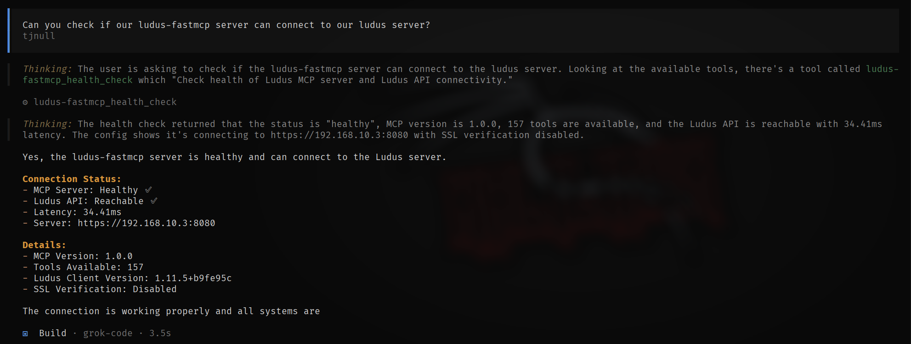
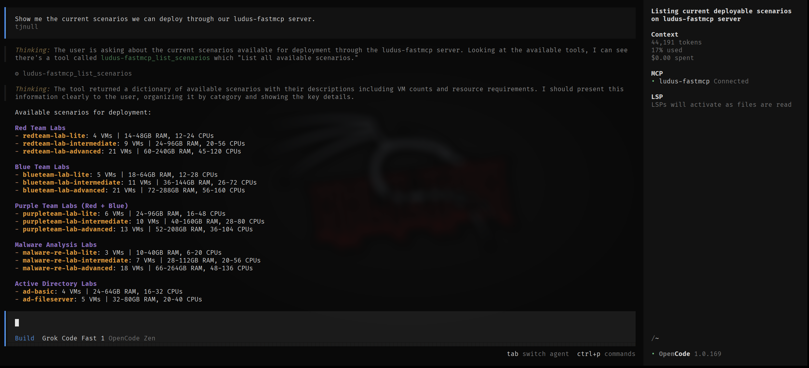
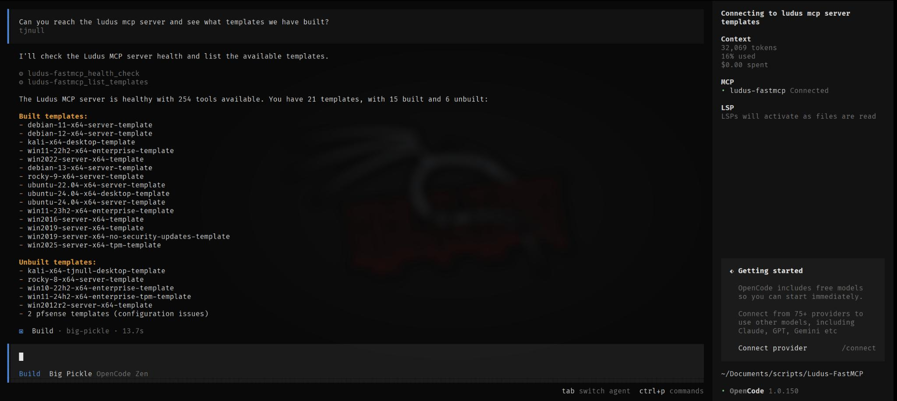
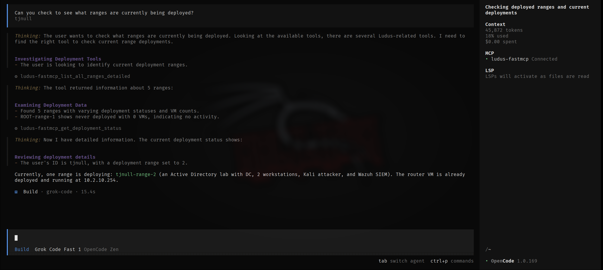

# Ludus FastMCP

[](https://github.com/tjnull/Ludus-FastMCP)
[](https://python.org)
[](https://docs.ludus.cloud)
[](LICENSE)

A Model Context Protocol (MCP) server for automating [Ludus](https://docs.ludus.cloud) cyber range environments through AI assistants written in Python.

## Overview

Ludus FastMCP enables AI-powered management of Ludus cyber ranges through natural language commands. The server exposes **190+ tools** across 20 modules for range lifecycle management, scenario deployment, template creation, Ansible role management, and security monitoring integration.

**Supports both Ludus v1 and v2** with automatic version detection. All existing v1 tools work unchanged, and v2 adds blueprints, groups, VM console, diagnostics, enhanced range management, and more.

### Key Capabilities

| Category | Description |
|----------|-------------|
| **Range Management** | Create, configure, deploy, and manage virtual lab environments |
| **Blueprints** | Save, share, and apply reusable range configurations (v2) |
| **Groups** | Organize users and ranges with group-based access control (v2) |
| **Scenario Deployment** | Pre-built scenarios for AD, red/blue/purple team, and malware analysis |
| **Template Builder** | Custom OS templates, skeleton configurations, and YAML generation |
| **Role Management** | Ansible Galaxy integration, custom roles, and subscription roles |
| **SIEM Integration** | Wazuh, Splunk, Elastic Stack, and Security Onion support |
| **AI Configuration** | Natural language to YAML configuration conversion |
| **Diagnostics** | System health, license info, and migration tools (v2) |

### Supported Platforms

Works with any MCP-compatible client including Claude Desktop, VS Code (Cline), OpenWebUI, and AnythingLLM.

## Quick Start

### Requirements

- Python 3.11+
- Access to a Ludus server instance (v1 or v2)
- Ludus API key or JWT token (for v2 Pro/SSO users)

### Installation

```bash
# Using pipx (recommended)
pipx install git+https://github.com/tjnull/Ludus-FastMCP

# From source
git clone https://github.com/tjnull/Ludus-FastMCP
cd Ludus-FastMCP
pip install -e .
```

### Setup

Run the interactive setup wizard:

```bash
ludus-fastmcp --setup
```

The wizard configures API credentials, tests connectivity, and generates MCP client configuration files.

For manual configuration options, see the [Configuration Guide](docs/configuration.md).

## Usage

### MCP Server (ludus-fastmcp)

```bash
ludus-fastmcp --setup          # Interactive setup wizard
ludus-fastmcp --list-tools     # List all 190+ available tools
ludus-fastmcp --version        # Display version information
ludus-fastmcp                  # Start MCP server
ludus-fastmcp --daemon         # Run as background service
```

### Client CLI (ludus-ai)

```bash
ludus-ai setup-llm                    # Configure local LLM (Ollama)
ludus-ai install anythingllm          # Install AnythingLLM interface
ludus-ai tool list-tools              # List available tools
ludus-ai tool call-tool <name>        # Execute tools directly
```

### Example Interactions

Once connected to an MCP client, interact with your Ludus environment:

```
Show my current range status
Deploy an Active Directory lab with Wazuh monitoring
Create a snapshot named "pre-attack" for all VMs
Build a lab with 2 domain controllers and 5 workstations
Create a blueprint from my current range and share it with the red-team group
Show system diagnostics and storage usage
List all groups and their members
```

Examples of using Ludus-FastMCP with grok code through Opencode.









## Documentation

| Document | Description |
|----------|-------------|
| [Getting Started](docs/getting-started.md) | Installation, setup, and first deployment |
| [Configuration](docs/configuration.md) | Environment variables and MCP client setup |
| [Tools Reference](docs/tools-reference.md) | Complete documentation for all 190+ tools |
| [Scenarios](docs/scenarios.md) | Pre-built deployment scenarios |
| [Troubleshooting](docs/troubleshooting.md) | Common issues and solutions |
| [Safety](docs/safety.md) | Safety features and best practices |

## Ludus Version Compatibility

| Feature | Ludus v1 | Ludus v2 |
|---------|----------|----------|
| Auto-detection | Automatic | Automatic |
| API Key auth | Yes | Yes |
| JWT auth (Pro/SSO) | No | Yes |
| Range management | Yes | Yes |
| Snapshots | Yes | Yes |
| Templates | Yes | Yes (+ subscription roles) |
| Blueprints | No | Yes |
| Groups | No | Yes |
| VM Console | No | Yes |
| Diagnostics | No | Yes |
| Multi-range access | No | Yes |

Version is auto-detected on first API call. Override with `LUDUS_API_VERSION=v1` or `LUDUS_API_VERSION=v2`. v2-only tools return a clear error message when used against a v1 server.

## Resources

| Resource | Link |
|----------|------|
| Ludus Documentation | [docs.ludus.cloud](https://docs.ludus.cloud) |
| Ludus API Reference | [api-docs.ludus.cloud](https://api-docs.ludus.cloud) |
| Ludus GitHub | [github.com/badsectorlabs/ludus](https://github.com/badsectorlabs/ludus) |
| FastMCP Framework | [gofastmcp.com](https://gofastmcp.com) |
| MCP Specification | [modelcontextprotocol.io](https://modelcontextprotocol.io) |

## Support

- [GitHub Issues](https://github.com/tjnull/Ludus-FastMCP/issues) - Bug reports and feature requests
- [GitHub Discussions](https://github.com/tjnull/Ludus-FastMCP/discussions) - Questions and community discussion

## License

This project is licensed under the MIT License. See [LICENSE](LICENSE) for details.

## Disclaimer

This software is intended for authorized security testing, educational purposes, and research in controlled environments. Users are responsible for compliance with applicable laws and organizational policies. The authors make no warranties and assume no liability for use or misuse of this software.

## Acknowledgments

- [Ludus](https://github.com/badsectorlabs/ludus) by Bad Sector Labs
- [FastMCP](https://gofastmcp.com), and the Model Context Protocol community.
